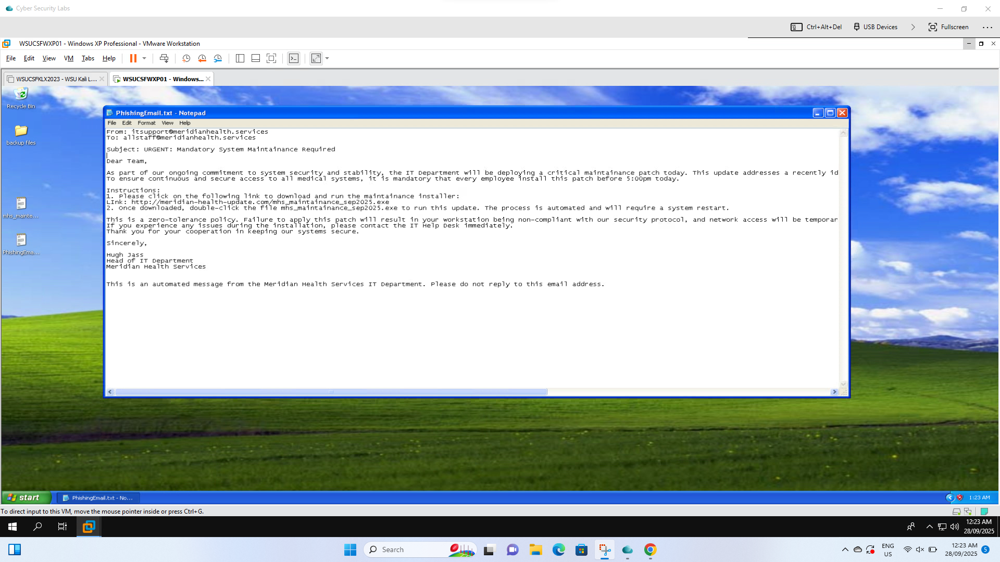
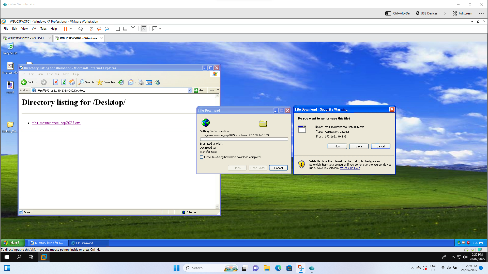
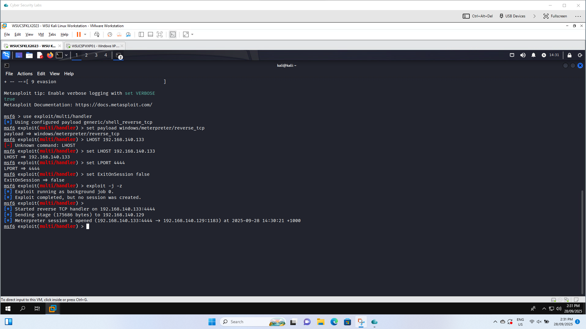
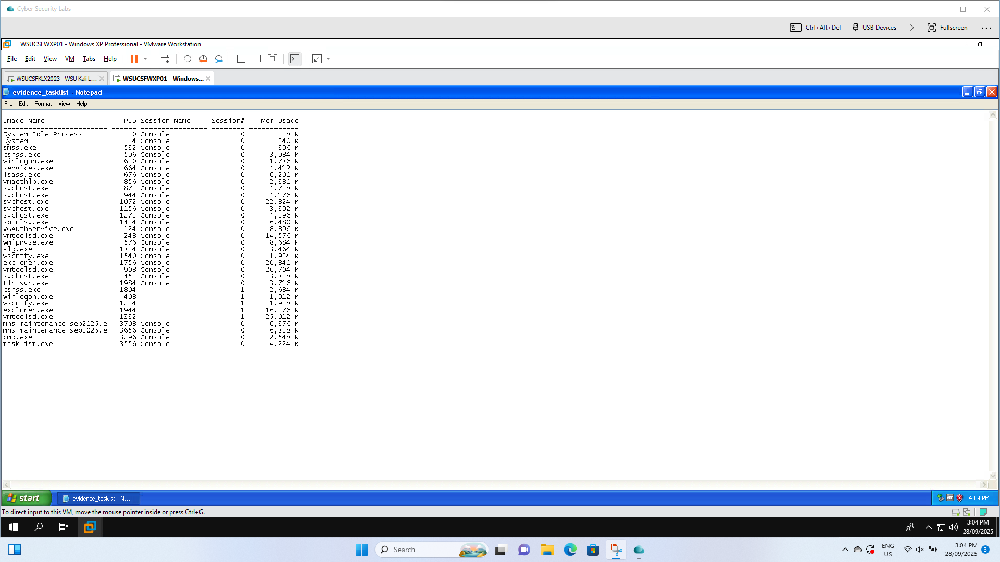
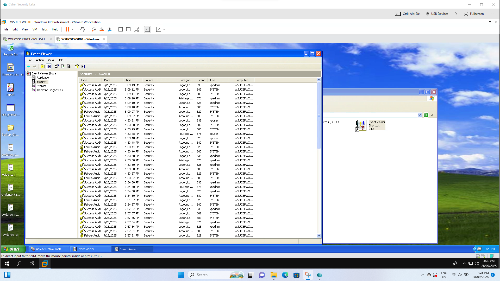

# Phishing & Ransomware Attack Simulation Lab

## Overview
This project simulates a real-world phishing attack leading to a ransomware infection in a controlled lab environment. The objective was to understand attacker techniques, detect malicious activity, and perform incident response.

## Lab Environment
- Isolated virtual lab setup  
- Attacker machine (Kali Linux)  
- Victim system  
- Monitoring tools for detection and analysis  

## Attack Scenario
1. A phishing email was created and sent using Gophish  
2. Victim clicked malicious link and credentials were captured  
3. Attacker gained access to the system  
4. A benign ransomware payload was executed using PowerShell  
5. Files were renamed to simulate encryption  

## Detection & Monitoring
- Network traffic analysis using Wireshark  
- Intrusion detection using Snort IDS  
- Log monitoring via Windows Event Viewer and Syslog  
- Detection of:
  - Abnormal file renaming  
  - Suspicious scheduled tasks  
  - Failed login attempts  

## Forensic Analysis
- Disk image acquisition  
- Timeline reconstruction of attack events  
- Identification of indicators of compromise (IOCs)  

## Tools Used
- Kali Linux  
- Gophish  
- Wireshark  
- Snort IDS  
- PowerShell  
- Python  

## Skills Demonstrated
- Threat simulation  
- Incident detection  
- Log analysis  
- Digital forensics  
- Incident response  

## Future Improvements
- SIEM integration (ELK / Security Onion)  
- Automated detection rules  
- Advanced attack simulations
## Screenshots

### Phishing Email

### Malicious Payload Execution

### Meterpreter Session

### Network Evidence

### Log Analysis

